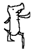
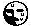
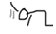

# Re-moticon
### Rebirth + Emoticon
*~ 리모티콘, 그시절 이모티콘의 재림 ~*


## 소개
안녕하세요. 개발자 로토리입니다. 이번엔 뭘 했냐면...

그시절 갠홈 세대를 위해, 그 당시에 사용했던 이모티콘을 갠홈에서도 출력할 수 있게 하는 라이브러리인, 일명 **리모티콘**을 만들어보았습니다.

이 라이브러리의 코드는 chatGPT의 도움을 받아 작성되었습니다.


## 동작
html 본문에 '**/애환**' 과 같이 텍스트가 있는 경우, 페이지가 로드되면 해당 문구가 이모티콘으로 치환됩니다.

마치 그 **옛날 메신저 이모티콘**처럼요!


현재 레포지토리에 미리 등록된 이모티콘만 호출이 가능합니다.

## 사용 방법
자신의 html 페이지에 
```html
<script src="https://rotorri.github.io/re-moticon/script.js"></script>
```
위 코드를 넣습니다.

끝입니다.

페이지를 새로고침 하여 이모티콘이 잘 치환 되는지 확인해보세요.


## 등록 된 이모티콘 예약어 목록

|예약어|이미지||예약어|이미지|
|:---:|:---:|---|:---:|:---:|
|/애환|||/뿎||
|/콩|||/ㅋㄲㅈㅁ||
|/절|||/우삼||
|/조삼|||/껌||
|/꺄|||/뽀뽀||
|/끄|||/굿||
|/삠|||/짞||
|/ㅠ|||/춤||
|/ㄱ-|||/ㅃ||
|/킥|||/땅||
|/도망|||/근엄||
|/붂|||/담||
|/피식|||/헉||
|/착잡|||/어이||
|/뭐야|||/하지||
|/컥||


## 사용 범위
어떠한 홈페이지에서 사용해도 상관 없습니다. 별도의 제한 없이 무료로 공개 배포하는 소스이므로 자유롭게 사용하여주세요. 소스의 일부를 수정하여 개인적으로 사용하여도 괜찮습니다. 다만 수정된 소스를 재배포하는 경우 현재의 레포지토리 출처를 남겨주세요.

## (고급) css 제어
호출된 이모티콘의 크기나 css 속성을 제어하려면 `.re-moticon` 클래스를 통해 제어해주세요.

이모티콘 이미지에는 기본적으로 `width:auto` 속성이 인라인으로 적용되어 호출됩니다.


## 이모티콘 추가 문의
준비중입니다.